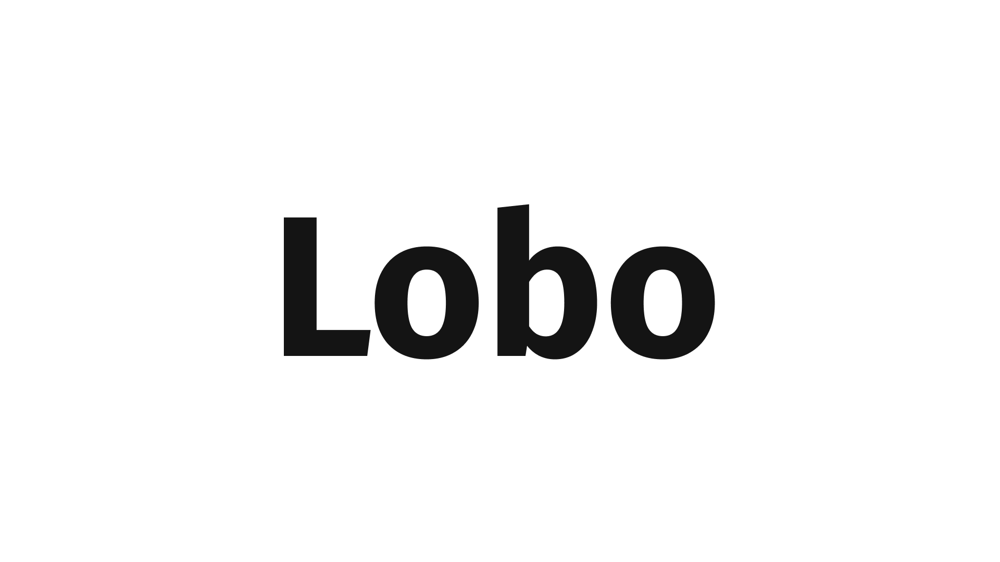

## 📌 Índice

- [Sobre](#-sobre)
- [Tecnologias utilizadas](#-tecnologias-utilizadas)
- [Como baixar o projeto](#-como-baixar-o-projeto)

---

## 🔖 Sobre

Este projeto é um portfólio que teve como objetivo trabalhar os conceitos básicos de HTML e CSS (estrutura semântica, CSS Grid Layout, CSS Flexbox entre outros) através do curso de HTML e CSS para Iniciantes da Origamid. Além disso, esse site foi um start para compreender e praticar todo o aprendizado a fim de construir um projeto mais complexo chamado **Bikcraft**.

<h3 align="center">
    <a href="https://rocketmusics.herokuapp.com/">Acessar a demonstração</a>
<h3>

---

## 🚀 Tecnologias utilizadas

O projeto foi desenvolvido utilizando as seguintes tecnologias:

- [HTML](https://developer.mozilla.org/pt-BR/docs/Web/HTML)
- [CSS](https://developer.mozilla.org/pt-BR/docs/Web/CSS)

---

## 🗂 Como baixar o projeto

```bash
    # Clonar o repositório
    $ git clone https://github.com/bagrielz/lobo-project

    # Entrar no diretório
    $ cd lobo-project
```

---

Desenvolvido 🤘 por Gabriel Stênio, direitos do projeto **Origamid**
